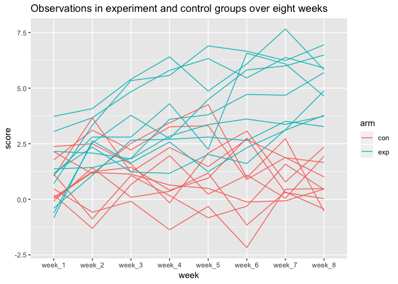
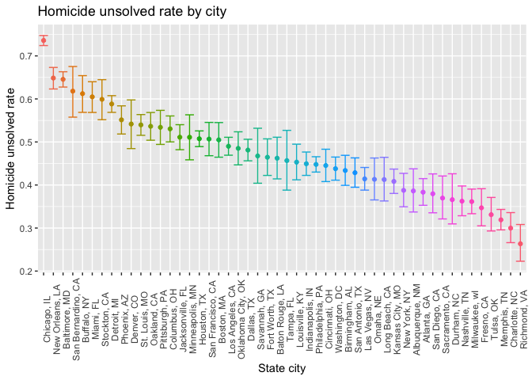

p8105\_hw5\_xs2330
================
Xiao Shi
November 1, 2018

Problem 1
---------

**initializing data frame and function construction**

``` r
exp_result = data_frame()

read_data = function(filepath){
  read_csv(filepath)
}
```

**Use function read\_data**

``` r
csvs = list.files("./")
exp_result = purrr::map_df(.x = csvs[1:20], read_data)
csvs = csvs[1:20] %>%
  str_replace(".csv", "")
```

First got a variable with all necessary file names, then use the function read\_data to get resulting data frame from 20 excel files. Finally, manipulate `csvs` for further use.

**tidy results**

``` r
exp_cleaned = mutate(exp_result, specimen_id = csvs) %>%
  mutate(unique_id = specimen_id) %>%
  separate(col = specimen_id, into = c("arm", "id"), sep = "_") %>%
  gather(key = week, value = score, week_1:week_8)
knitr::kable(exp_cleaned[1:6,])
```

| arm | id  | unique\_id | week    |  score|
|:----|:----|:-----------|:--------|------:|
| con | 01  | con\_01    | week\_1 |   0.20|
| con | 02  | con\_02    | week\_1 |   1.13|
| con | 03  | con\_03    | week\_1 |   1.77|
| con | 04  | con\_04    | week\_1 |   1.04|
| con | 05  | con\_05    | week\_1 |   0.47|
| con | 06  | con\_06    | week\_1 |   2.37|

**ploting experimental vs control group**

``` r
ggplot(data = exp_cleaned, mapping = aes(x = week, y = score, group = unique_id, color = arm)) +
  geom_line() +
  labs(title = "Observations in experiment and control groups over eight weeks")
```



From the colored spagatti plot, we see a higher score distribution in the experimental group, and lower score distribution in the control group. Also, we observe that both groups started at approximately the same level. However, as we approach week\_8, everyone in the experimental group has a hight score than everyone in the control group. Since the experiment is randomized, there is no need to distinguish within-group score differences, thus all subjects in the same arm are assigned the same color.

Problem 2
---------

**create city\_state**

``` r
raw_homicide = read_csv("./homicide-data.csv") 
homicide = raw_homicide %>%
  mutate(city_state = str_c(city, state, sep = ", ")) %>%
  janitor::clean_names()
```

The raw homicide dataset consists of case information (uid, reported\_date, disposition), geo information (city, state, lat, lon), and victim information (race, age, first and last name) of homicidal crimes on 50 large U.S. cities. The data is consist of 52179 rows by 13 columns.

**summarize within cities**

``` r
homicide_city_total = count(homicide, city_state)
homicide_city_unsolved = homicide %>%
  filter(disposition == "Closed without arrest" | disposition == "Open/No arrest") %>%
  count(city_state)
```

Above summarizes within cities to obtain the total number of homicides and the number of unsolved homicides (those for which the disposition is “Closed without arrest” or “Open/No arrest”). Also, `Tulsa, AL` has no unsolved case thus will be excluded in the analysis from this point further.

**Baltimore, MD**

**proportion of homicides that are unsolved in Baltimore**

``` r
x = as.integer(homicide_city_unsolved[which(homicide_city_unsolved$city_state == "Baltimore, MD"),2])
n = as.integer(homicide_city_total[which(homicide_city_total$city_state == "Baltimore, MD"),2])
balti_homicide = prop.test(x,n)
```

**save the output of prop.test as an R object**

``` r
save(balti_homicide, file = "./homicide_balti.rdata")
```

**tidy and pull results**

``` r
balti_result = broom::tidy(balti_homicide) %>%
  janitor::clean_names() %>%
  select(estimate, conf_low, conf_high)
row.names(balti_result) = "Baltimore, MD"
```

**all cities**

**construct function**

``` r
output_allcities = data_frame()

prop.all = function(city_name){
  x = as.integer(homicide_city_unsolved[which(homicide_city_unsolved$city_state == city_name),2])
  n = as.integer(homicide_city_total[which(homicide_city_total$city_state == city_name),2])
  test_result = prop.test(x,n) %>%
    broom::tidy() %>%
    janitor::clean_names() %>%
    select(estimate, conf_low, conf_high)
}
```

**use the prop.all function to extract results for all cities**

``` r
output_allcities = purrr::map_df(.x = homicide_city_unsolved$city_state, prop.all) %>%
  mutate(city = homicide_city_unsolved$city_state) %>%
  select(city, estimate, conf_low, conf_high)
knitr::kable(output_allcities)
```

| city               |   estimate|  conf\_low|  conf\_high|
|:-------------------|----------:|----------:|-----------:|
| Albuquerque, NM    |  0.3862434|  0.3372604|   0.4375766|
| Atlanta, GA        |  0.3833505|  0.3528119|   0.4148219|
| Baltimore, MD      |  0.6455607|  0.6275625|   0.6631599|
| Baton Rouge, LA    |  0.4622642|  0.4141987|   0.5110240|
| Birmingham, AL     |  0.4337500|  0.3991889|   0.4689557|
| Boston, MA         |  0.5048860|  0.4646219|   0.5450881|
| Buffalo, NY        |  0.6122841|  0.5687990|   0.6540879|
| Charlotte, NC      |  0.2998544|  0.2660820|   0.3358999|
| Chicago, IL        |  0.7358627|  0.7239959|   0.7473998|
| Cincinnati, OH     |  0.4452450|  0.4079606|   0.4831439|
| Columbus, OH       |  0.5304428|  0.5002167|   0.5604506|
| Dallas, TX         |  0.4811742|  0.4561942|   0.5062475|
| Denver, CO         |  0.5416667|  0.4846098|   0.5976807|
| Detroit, MI        |  0.5883287|  0.5687903|   0.6075953|
| Durham, NC         |  0.3659420|  0.3095874|   0.4260936|
| Fort Worth, TX     |  0.4644809|  0.4222542|   0.5072119|
| Fresno, CA         |  0.3470226|  0.3051013|   0.3913963|
| Houston, TX        |  0.5074779|  0.4892447|   0.5256914|
| Indianapolis, IN   |  0.4493192|  0.4223156|   0.4766207|
| Jacksonville, FL   |  0.5111301|  0.4820460|   0.5401402|
| Kansas City, MO    |  0.4084034|  0.3803996|   0.4370054|
| Las Vegas, NV      |  0.4141926|  0.3881284|   0.4407395|
| Long Beach, CA     |  0.4126984|  0.3629026|   0.4642973|
| Los Angeles, CA    |  0.4900310|  0.4692208|   0.5108754|
| Louisville, KY     |  0.4531250|  0.4120609|   0.4948235|
| Memphis, TN        |  0.3190225|  0.2957047|   0.3432691|
| Miami, FL          |  0.6048387|  0.5685783|   0.6400015|
| Milwaukee, wI      |  0.3614350|  0.3333172|   0.3905194|
| Minneapolis, MN    |  0.5109290|  0.4585150|   0.5631099|
| Nashville, TN      |  0.3624511|  0.3285592|   0.3977401|
| New Orleans, LA    |  0.6485356|  0.6231048|   0.6731615|
| New York, NY       |  0.3875598|  0.3494421|   0.4270755|
| Oakland, CA        |  0.5364308|  0.5040588|   0.5685037|
| Oklahoma City, OK  |  0.4851190|  0.4467861|   0.5236245|
| Omaha, NE          |  0.4132029|  0.3653146|   0.4627477|
| Philadelphia, PA   |  0.4478103|  0.4300380|   0.4657157|
| Phoenix, AZ        |  0.5514223|  0.5184825|   0.5839244|
| Pittsburgh, PA     |  0.5340729|  0.4942706|   0.5734545|
| Richmond, VA       |  0.2634033|  0.2228571|   0.3082658|
| Sacramento, CA     |  0.3696809|  0.3211559|   0.4209131|
| San Antonio, TX    |  0.4285714|  0.3947772|   0.4630331|
| San Bernardino, CA |  0.6181818|  0.5576628|   0.6753422|
| San Diego, CA      |  0.3796095|  0.3354259|   0.4258315|
| San Francisco, CA  |  0.5067873|  0.4680516|   0.5454433|
| Savannah, GA       |  0.4674797|  0.4041252|   0.5318665|
| St. Louis, MO      |  0.5396541|  0.5154369|   0.5636879|
| Stockton, CA       |  0.5990991|  0.5517145|   0.6447418|
| Tampa, FL          |  0.4567308|  0.3881009|   0.5269851|
| Tulsa, OK          |  0.3310463|  0.2932349|   0.3711192|
| Washington, DC     |  0.4379182|  0.4112495|   0.4649455|

**Homicide unsolved rate by city**

``` r
ggplot(output_allcities, mapping = aes(x = reorder(city, -estimate), y = estimate, color = reorder(city, -estimate))) +
  geom_point() +
  geom_errorbar(aes(ymin = conf_low, ymax = conf_high)) +
  labs(x = "State city", y = "Homicide unsolved rate", title = "Homicide unsolved rate by city") +
  theme(legend.position = "none") +
  theme(axis.text.x = element_text(angle = 90))
```



The above graph shows the estimates and CI of unsolved rate of homicide in each city, in a decreasing order.
